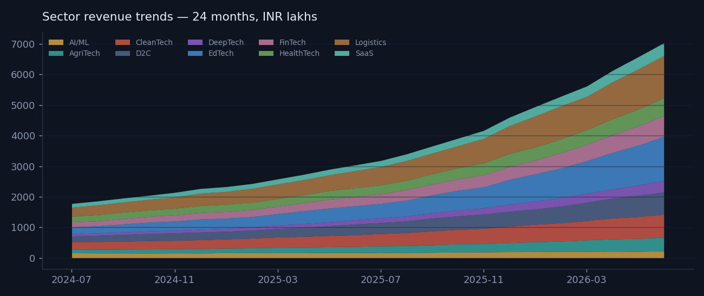
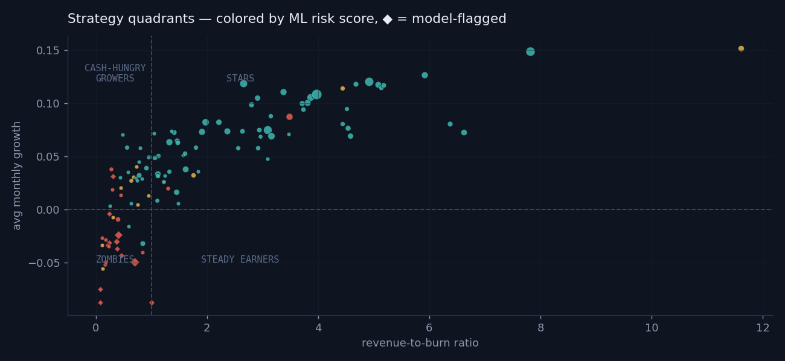
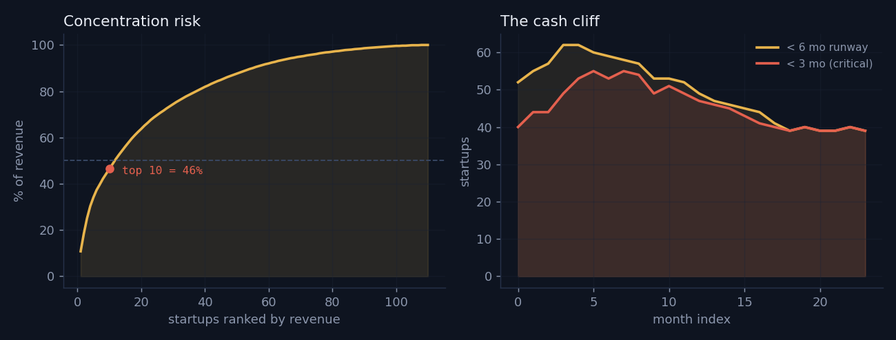

# Phase 3 — Decision Dashboards

**Why this phase exists:** Phases 1 and 2 produce data and model scores — numbers in tables.
Numbers don't drive decisions until someone can *see* them. Phase 3 turns the warehouse and
the risk model into visual tools an incubator director could actually use: which sectors are
growing, which startups are burning out, and where to send help first.

### 🔗 [View the live dashboards →](https://prrbhdeep.github.io/startup-portfolio-analytics/)

Everything below is interactive on the live site (hover, zoom, legend filtering).
GitHub can't render HTML, so here are static previews:

---

## Annex A · Portfolio Health Dashboard
*Where is the portfolio making money?*

Sector revenue over 24 months, a ranked burn-efficiency ladder of all 110 startups,
and the strategy quadrant map below.

The quadrant map merges Phase 2 into Phase 3: every bubble is a startup, sized by
revenue, **colored by the ML model's risk score**, diamonds = flagged by the model.
The four quadrants map directly to actions: double down (Stars), fund (Cash-Hungry
Growers), maintain (Steady Earners), intervene (Zombies).

## Annex C · Fund-Level Insights
*Four questions a fund director would ask.*

- **Concentration risk** — the top 10 startups generate **46% of portfolio revenue**
- **The cash cliff** — 39 startups currently hold under 6 months of runway
- **Sector risk–return** — EdTech leads growth-per-risk; AI/ML is the riskiest book
- **Capital efficiency** — median revenue per lakh raised, by funding stage

## Annex B · ML Risk Model Report
Interactive version of the Phase 2 analysis: score separation, risk drivers,
every startup scored, and an honest flag audit (8 correct / 3 false positives / 7 missed).
See it [on the live site](https://prrbhdeep.github.io/startup-portfolio-analytics/ml_model_report.html).

---

## Files in this folder

| File | What it is |
|---|---|
| `dashboard.py` | Original Plotly dashboard (Python-generated, 4 panels) |
| `dashboard_template.html` | ECharts source for Annex A (data injected at `/*DATA*/`) |
| `insights_template.html` | ECharts source for Annex C |
| `dash_data.json`, `insights_data.json` | Chart data extracted from the warehouse + risk model |
| `previews/` | Static preview images for this README |

Deployed pages live in [`/docs`](../docs) and are served by GitHub Pages.
A Tableau Public build of the same views is on [my Tableau profile](https://public.tableau.com/app/profile/prabhdeep.sohal/vizzes).

## Design notes
Single design system across all pages: dark blue-slate ledger aesthetic, serif display
type (Newsreader) with monospaced data figures (IBM Plex Mono), and a consistent
semantic palette — amber = capital, teal = healthy, coral = risk. ECharts bundled
inline so pages work offline with no CDN dependency.
